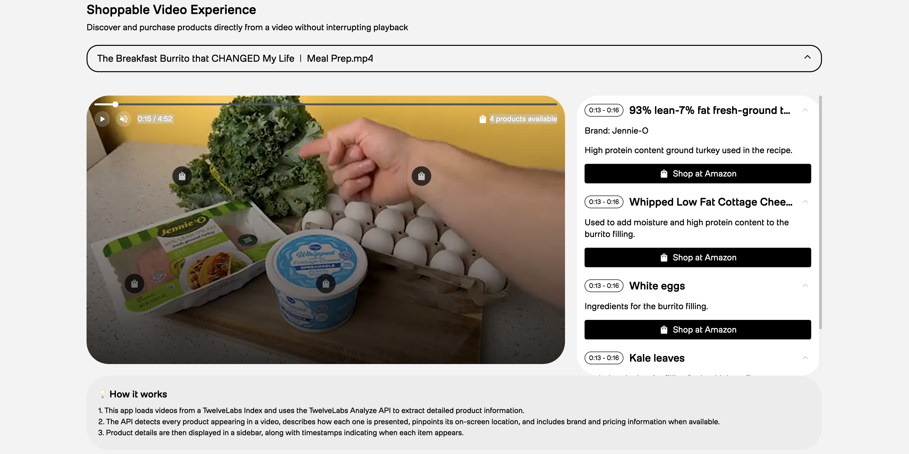

# Shoppable Video – AI-Powered In-Video Commerce Demo

A sample web application that turns any streaming video into an interactive, “shop-the-look” experience.
Built on **TwelveLabs’ Analyze API**, the app detects products that appear in specific frames, generates contextual descriptions, and lets viewers check-out without pausing playback – mirroring TikTok Shop’s contextual commerce flow but optimized for long-form streaming content.



## ✨ Key Capabilities

- **Product Detection** – AI-powered analysis identifies products in video frames
- **Contextual Product Information** – Automatically generates descriptions and product details based on visual content
- **Dynamic Product Markers** – Visual indicators appear only when products are detected on screen
- **Amazon Integration** – Direct links to Amazon search results for detected products

## 🖼️ UI Walkthrough

1. **Product Markers** – Animated icons appear only when a product is on screen.
2. **Context Sidebar** – When the product appears in the video, the product name and description are automatically displayed.
3. **Checkout Flow** – Clicking the "Shop At Amazon" button takes you to the Amazon search results page for that product.

## ⚙️ Built with

- **Twelve Labs API** – For analyzing video and saving analyzed data to each video
- **Next.js 14 / React 18**
- **TypeScript**
- **Tailwind CSS 3 + MUI**
- **React-Player**

## 🚀 Quick Start

### 1. Clone & install

```bash
git clone git@github.com:mrnkim/ShoppableVideo.git
npm install
```

### 2. Configure environment

Customize `.env.example` as follows:

```bash
TWELVELABS_API_KEY=<YOUR_API_KEY>
NEXT_PUBLIC_DEFAULT_INDEX_ID=<YOUR_DEFAULT_INDEX_ID>

# Optional: defaults to api version 1.3
TWELVELABS_API_BASE_URL=https://api.twelvelabs.io/v1.3
```

### 3. Run dev server

```bash
npm run dev
```

### 4. Open in Browser

Open http://localhost:3000
